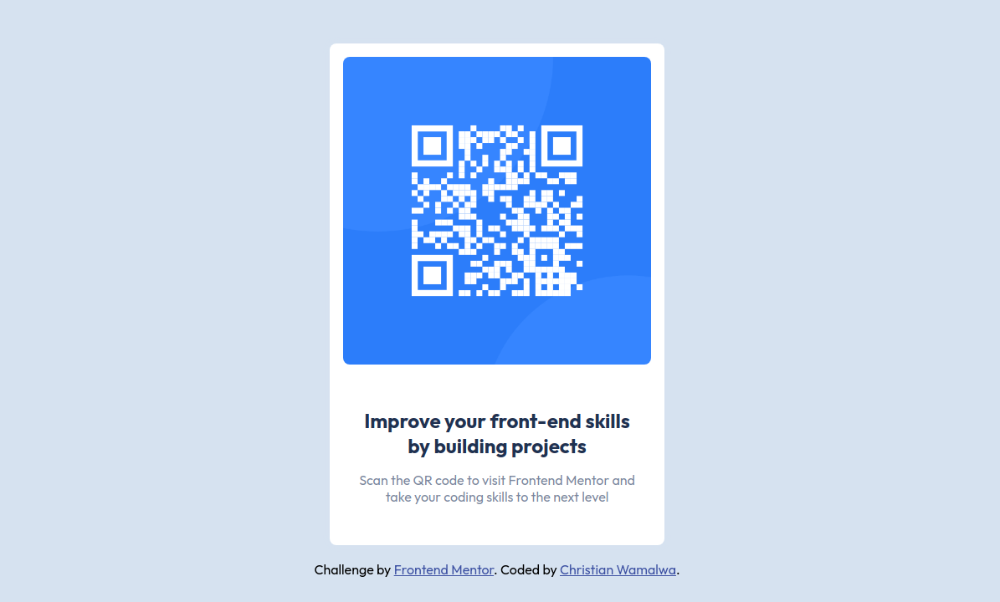

# Frontend Mentor - QR code component solution

This is a solution to the [QR code component challenge on Frontend Mentor](https://www.frontendmentor.io/challenges/qr-code-component-iux_sIO_H). Frontend Mentor challenges help you improve your coding skills by building realistic projects.

## Table of contents

- [Overview](#overview)
  - [Screenshot](#screenshot)
  - [Links](#links)
- [My process](#my-process)
  - [Built with](#built-with)
- [Author](#author)

## Overview

The Frontend Mentor QR Code Challenge involves creating a simple and visually appealing web component that displays a QR code. The component should be responsive and should display a QR code that can be scanned by a mobile device.

### Screenshot

This is a screenshot of my solution.

### Links

- Solution URL: [Code](https://github.com/10-menachi/qr_code)
- Live Site URL: [Live](https://10-menachi.github.io/qr_code/)

## My process

### Built with

- Semantic HTML5 markup
- CSS custom properties
- Flexbox

## Author

- Website - [Christian Wamalwa](https://10-menachi.github.io/portfolio/)
- Frontend Mentor - [@10-menachi](https://www.frontendmentor.io/profile/10-menachi)
- Twitter - [@christian_timbe](https://www.twitter.com/christian_timbe)
